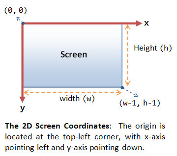
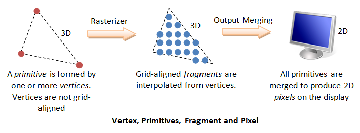
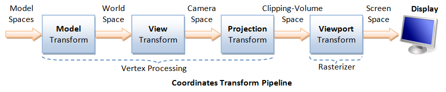
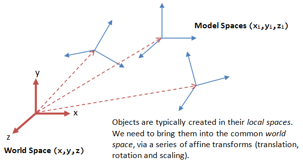
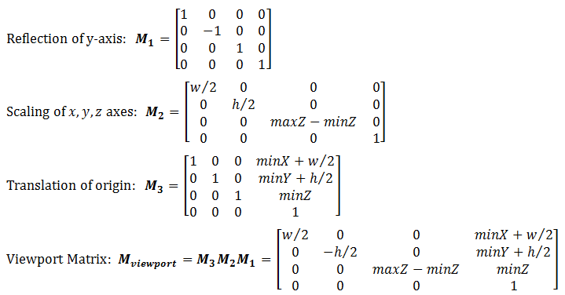

# **Semana 3: Gráficos 3D con OpenGL - La Teoría Básica**

## **¿Qué es OpenGL?**

OpenGL es una API multiplataforma (navegadores, dispositivos móviles, PC) y multilenguaje (C++, Python, JavaScript, entre otros) utilizada para renderizar gráficos vectoriales en 2D y 3D.

Esta API se emplea principalmente para interactuar con la GPU (Unidad de Procesamiento Gráfico) y lograr un renderizado acelerado por hardware.

Con OpenGL es posible dibujar escenas tridimensionales complejas a partir de primitivas geométricas simples, tales como puntos, líneas y triángulos.

## **Hardware de Gráficos por Computadora**


### **GPU (Unidad de Procesamiento Gráfico)**

Las computadoras modernas tienen una Unidad de Procesamiento Gráfico (GPU) dedicada para producir imágenes para la pantalla, con su propia memoria gráfica (o VRAM, `Video RAM`).

### **Píxeles y Frames**



Todas las pantallas modernas están basadas en raster. Un raster es una cuadrícula rectangular 2D de píxeles (o elementos de imagen). Un píxel tiene dos propiedades: un color y una posición. El color se expresa en componentes RGB (Rojo-Verde-Azul), típicamente 8 bits por componente o 24 bits por píxel (o `true color`). La posición se expresa en términos de coordenadas (x, y). El origen (0, 0) se encuentra en la esquina superior izquierda, con el eje x apuntando hacia la derecha y el eje y apuntando hacia abajo. Esto es diferente de las coordenadas cartesianas 2D convencionales, donde el eje y apunta hacia arriba.

El número de bits de color por píxel se llama la `profundidad` (o `precisión`) de la pantalla. El número de filas por columnas de la cuadrícula rectangular se llama la `resolución` de la pantalla, que puede variar desde 640x480 (VGA), 800x600 (SVGA), 1024x768 (XGA) hasta 1920x1080 (FHD), o incluso superior.

### **Frame Buffer y Tasa de Refresco**


Los valores de color de los píxeles se almacenan en una parte especial de la memoria gráfica llamada `frame buffer`. La GPU escribe el valor de color en el frame buffer. La pantalla lee los valores de color del frame buffer fila por fila, de izquierda a derecha, de arriba a abajo, y coloca cada uno de los valores en la pantalla. Esto se conoce como `raster-scan`. La pantalla refresca su imagen varias docenas de veces por segundo, típicamente a 60Hz para monitores LCD y más alto para tubos CRT. Esto se conoce como la `tasa de refresco`.

Una imagen de pantalla completa se llama un `frame`.

### **Doble Búfer y VSync**

Mientras la pantalla está leyendo del frame buffer para mostrar el frame actual, podríamos estar actualizando su contenido para el siguiente frame (no necesariamente en forma de raster-scan). Esto resultaría en el llamado `tearing`, en el que la pantalla muestra partes del frame antiguo y partes del nuevo.

Esto se puede resolver utilizando el llamado `doble búfer`. En lugar de usar un solo frame buffer, las GPU modernas usan dos: un `front buffer` y un `back buffer`. La pantalla lee desde el front buffer, mientras que nosotros podemos escribir el siguiente frame en el back buffer. Cuando terminamos, le indicamos a la GPU que intercambie el front y el back buffer (conocido como `buffer swap` o `page flip`).

El doble búfer por sí solo no resuelve todo el problema, ya que el intercambio de búfer podría ocurrir en un momento inadecuado, por ejemplo, mientras la pantalla está en medio de la visualización del frame antiguo. Esto se resuelve mediante la llamada `sincronización vertical` (o `VSync`) al final del raster-scan. Cuando le indicamos a la GPU que haga un intercambio de búfer, la GPU esperará hasta el siguiente VSync para realizar el intercambio real, después de que se muestre todo el frame actual.

El punto más importante es: ¡Cuando el intercambio de búfer con VSync está habilitado, no se puede refrescar la pantalla más rápido que la tasa de refresco de la pantalla! Para las pantallas LCD/LED, la tasa de refresco suele estar bloqueada en 60Hz o 60 frames por segundo, o 16.7 milisegundos por cada frame. Además, si su aplicación se refresca a una velocidad fija, la tasa de refresco resultante probablemente será un factor entero de la tasa de refresco de la pantalla, es decir, 1/2, 1/3, 1/4, etc.

## **Pipeline de Renderizado de Gráficos 3D**

Un `pipeline`, en terminología informática, se refiere a una serie de etapas de procesamiento en las que la salida de una etapa se introduce como entrada de la siguiente, similar a una línea de ensamblaje de fábrica o una tubería de agua/aceite. Con un paralelismo masivo, el pipeline puede mejorar en gran medida el rendimiento general.

En gráficos por computadora, el `renderizado` es el proceso de producir una imagen en la pantalla a partir de la descripción de un modelo.

El `Pipeline de Renderizado de Gráficos 3D` acepta la descripción de objetos 3D en términos de vértices de primitivas (como triángulos, puntos, líneas y quads), y produce el valor de color para los píxeles en la pantalla.


El pipeline de renderizado de gráficos 3D consta de las siguientes etapas principales:

1.  **Procesamiento de Vértices:** Procesa y transforma vértices individuales.
2.  **Rasterización:** Convierte cada primitiva (vértices conectados) en un conjunto de fragmentos. Un fragmento puede ser tratado como un píxel en espacios 3D, que está alineado con la cuadrícula de píxeles, con atributos como posición, color, normal y textura.
3.  **Procesamiento de Fragmentos:** Procesa fragmentos individuales.
4.  **Fusión de Salida:** Combina los fragmentos de todas las primitivas (en el espacio 3D) en píxeles de color 2D para la pantalla.

En las GPU modernas, la etapa de procesamiento de vértices y la etapa de procesamiento de fragmentos son programables. Se pueden escribir programas, conocidos como `vertex shader` y `fragment shader`, para realizar transformaciones personalizadas para vértices y fragmentos. Los programas de shader se escriben en lenguajes de alto nivel similares a C, como GLSL (OpenGL Shading Language), HLSL (High-Level Shading Language para Microsoft Direct3D), o Cg (C for Graphics de NVIDIA).

Por otro lado, las etapas de rasterización y fusión de salida no son programables, pero sí configurables, a través de comandos de configuración emitidos a la GPU.

## **Vértices, Primitivas, Fragmentos y Píxeles**

### **Sistemas de Coordenadas de Gráficos 3D**


OpenGL adopta el `Sistema de Coordenadas de Mano Derecha` (RHS, `Right-Hand Coordinate System`). En el RHS, el eje x apunta a la derecha, el eje y apunta hacia arriba, y el eje z apunta hacia afuera de la pantalla. Con los dedos de la mano derecha curvándose desde el eje x hacia el eje y, el pulgar apunta en la dirección del eje z. El RHS es `counter-clockwise` (CCW, antihorario). Las Coordenadas Cartesianas 3D son un RHS.

Algunos software de gráficos (como Microsoft Direct3D) usan el `Sistema de Mano Izquierda` (LHS), donde el eje z está invertido. El LHS es `clockwise` (CW, horario). En este artículo, adoptaremos el RHS y CCW utilizados en OpenGL.

### **Primitivas**

Las entradas al Pipeline de Renderizado de Gráficos son `primitivas` geométricas (como triángulos, puntos, líneas o quads), que están formadas por `uno o más vértices`.

OpenGL admite tres clases de primitivas geométricas: `puntos`, `segmentos de línea` y `polígonos cerrados`. Se especifican a través de vértices. Cada vértice está asociado con sus atributos, como la posición, el color, la normal y la textura. OpenGL proporciona 10 primitivas como se muestra. La esfera, la caja 3D y la pirámide no son primitivas. Típicamente se ensamblan usando primitivas de triángulo o quad.


### **Vértices**

Recuerda que `una primitiva está formada por uno o más vértices`. Un `vértice`, en gráficos por computadora, tiene estos atributos:

1.  **Posición en el espacio 3D `V` = (`x`, `y`, `z`):** típicamente expresada en números de punto flotante.
2.  **Color:** expresado en componentes RGB (Rojo-Verde-Azul) o RGBA (Rojo-Verde-Azul-Alfa). Los valores de los componentes suelen normalizarse al rango de 0.0 a 1.0 (o un entero sin signo de 8 bits entre 0 y 255). Alfa se usa para especificar la transparencia, con un alfa de 0 para totalmente transparente y un alfa de 1 para opaco.
3.  **Normal del Vértice `N` = (`nx`, `ny`, `nz`):** Estamos familiarizados con el concepto de normal de superficie, donde el vector normal es perpendicular a la superficie. En gráficos por computadora, sin embargo, necesitamos adjuntar un vector normal a cada vértice, conocido como `normal de vértice`. Las normales se usan para diferenciar la cara frontal y la trasera, y para otros procesamientos como la iluminación. La regla de la mano derecha (o antihoraria) se usa en OpenGL. La normal apunta hacia afuera, indicando la superficie exterior (o cara frontal).
4.  **Textura `T` = (`s`, `t`):** En gráficos por computadora, a menudo envolvemos una imagen 2D en un objeto para que parezca realista. Un vértice podría tener coordenadas de textura 2D (`s`, `t`), que proporcionan un punto de referencia a una imagen de textura 2D.
5.  Otros.

#### **Primitivas y Vértices de OpenGL**


Como ejemplo, el siguiente segmento de código de OpenGL especifica un cubo de color, centrado en el origen.

Para crear un objeto geométrico o `modelo`, usamos un par de `glBegin(_PrimitiveType_)` y `glEnd()` para encerrar los vértices que forman el modelo. Para `primitiveType` que termina en 'S' (por ejemplo, `GL_QUADS`), podemos definir múltiples formas del mismo tipo.

Cada una de las 6 caras es una primitiva quad (`GL_QUAD`). Primero establecemos el color a través de `glColor3f(red, green, blue)`. Este color se aplicaría a todos los vértices posteriores hasta que se anule. Los 4 vértices del quad se especifican a través de `glVertex3f(x, y, z)`, en sentido antihorario para que la normal de la superficie apunte hacia afuera, indicando su cara frontal. Los cuatro vértices tienen esta normal de superficie como su normal de vértice.
```c++
glBegin(GL_QUADS); // del cubo de color
 
   // Cara superior
   glColor3f(0.0f, 1.0f, 0.0f); // verde
   glVertex3f(1.0f, 1.0f, -1.0f);
   glVertex3f(-1.0f, 1.0f, -1.0f);
   glVertex3f(-1.0f, 1.0f, 1.0f);
   glVertex3f(1.0f, 1.0f, 1.0f);
 
   // Cara inferior
   glColor3f(1.0f, 0.5f, 0.0f); // naranja
   glVertex3f(1.0f, -1.0f, 1.0f);
   glVertex3f(-1.0f, -1.0f, 1.0f);
   glVertex3f(-1.0f, -1.0f, -1.0f);
   glVertex3f(1.0f, -1.0f, -1.0f);
 
   // Cara frontal
   glColor3f(1.0f, 0.0f, 0.0f); // rojo
   glVertex3f(1.0f, 1.0f, 1.0f);
   glVertex3f(-1.0f, 1.0f, 1.0f);
   glVertex3f(-1.0f, -1.0f, 1.0f);
   glVertex3f(1.0f, -1.0f, 1.0f);
 
   // Cara trasera
   glColor3f(1.0f, 1.0f, 0.0f); // amarillo
   glVertex3f(1.0f, -1.0f, -1.0f);
   glVertex3f(-1.0f, -1.0f, -1.0f);
   glVertex3f(-1.0f, 1.0f, -1.0f);
   glVertex3f(1.0f, 1.0f, -1.0f);
 
   // Cara izquierda
   glColor3f(0.0f, 0.0f, 1.0f); // azul
   glVertex3f(-1.0f, 1.0f, 1.0f);
   glVertex3f(-1.0f, 1.0f, -1.0f);
   glVertex3f(-1.0f, -1.0f, -1.0f);
   glVertex3f(-1.0f, -1.0f, 1.0f);
 
   // Cara derecha
   glColor3f(1.0f, 0.0f, 1.0f); // magenta
   glVertex3f(1.0f, 1.0f, -1.0f);
   glVertex3f(1.0f, 1.0f, 1.0f);
   glVertex3f(1.0f, -1.0f, 1.0f);
   glVertex3f(1.0f, -1.0f, -1.0f);
 
glEnd(); // del cubo de color
```

#### **Vértices Indexados**

Las primitivas a menudo comparten vértices. En lugar de especificar repetidamente los vértices, es más eficiente crear una lista de índices de vértices y usar los índices para especificar las primitivas.

Por ejemplo, el siguiente fragmento de código especifica una pirámide, que está formada por 5 vértices. Primero definimos 5 vértices en un array de índices, seguidos de su color respectivo. Para cada una de las 5 caras, simplemente proporcionamos el índice del vértice y el índice del color.
```java
float[] vertices = { // 5 vértices de la pirámide en (x,y,z)
      -1.0f, -1.0f, -1.0f,  // 0. izquierdo-inferior-atrás
       1.0f, -1.0f, -1.0f,  // 1. derecho-inferior-atrás
       1.0f, -1.0f,  1.0f,  // 2. derecho-inferior-adelante
      -1.0f, -1.0f,  1.0f,  // 3. izquierdo-inferior-adelante
       0.0f,  1.0f,  0.0f   // 4. superior
};
          
float[] colors = {  // Colores de los 5 vértices en RGBA
      0.0f, 0.0f, 1.0f, 1.0f,  // 0. azul
      0.0f, 1.0f, 0.0f, 1.0f,  // 1. verde
      0.0f, 0.0f, 1.0f, 1.0f,  // 2. azul
      0.0f, 1.0f, 0.0f, 1.0f,  // 3. verde
      1.0f, 0.0f, 0.0f, 1.0f   // 4. rojo
};
  
byte[] indices = { // Índices de vértices de los 4 Triángulos
      2, 4, 3,   // cara frontal (CCW)
      1, 4, 2,   // cara derecha
      0, 4, 1,   // cara trasera
      4, 0, 3    // cara izquierda
};
 
// Transferir los arrays al vertex-buffer, color-buffer e index-buffer.
// Dibujar las primitivas (triángulo) desde el index buffer
```

### **Píxel vs. Fragmento**

Los píxeles se refieren a los puntos en la pantalla, que están alineados en una cuadrícula bidimensional de un cierto número de filas y columnas correspondiente a la resolución de la pantalla. Un píxel es bidimensional, con una posición (`x`, `y`) y un valor de color RGB (no hay valor alfa para los píxeles). El propósito del Pipeline de Renderizado de Gráficos es producir el valor de color para todos los píxeles para mostrarlos en la pantalla, dadas las primitivas de entrada.



Para producir los píxeles alineados con la cuadrícula para la pantalla, el `rasterizador` del pipeline de renderizado de gráficos, como su nombre lo indica, toma cada primitiva de entrada y realiza un `raster-scan` para producir un conjunto de fragmentos alineados con la cuadrícula y encerrados dentro de la primitiva. Un fragmento es tridimensional, con una posición (`x`, `y`, `z`). Las coordenadas (`x`, `y`) están alineadas con la cuadrícula de píxeles 2D. El valor `z` (no alineado con la cuadrícula) denota su profundidad. Los valores z son necesarios para capturar la profundidad relativa de varias primitivas, de modo que los objetos ocluidos puedan descartarse (o el canal alfa de los objetos transparentes procesarse) en la etapa de fusión de salida.

Los fragmentos se producen mediante la `interpolación` de los vértices. Por lo tanto, un fragmento tiene todos los atributos del vértice, como color, normal de fragmento y coordenadas de textura.

En las GPU modernas, el procesamiento de vértices y el procesamiento de fragmentos son programables. Los programas se llaman vertex shader y fragment shader.

(Direct3D usa el término "píxel" para "fragmento".)

## **Procesamiento de Vértices**

### **Transformación de Coordenadas**

El proceso utilizado para producir una escena 3D en la pantalla en Gráficos por Computadora es como tomar una fotografía con una cámara. Implica cuatro transformaciones:

1.  Organizar los objetos (o modelos, o avatares) en el mundo (`Transformación de Modelo` o `Transformación del Mundo`).
2.  Posicionar y orientar la cámara (`Transformación de Vista`).
3.  Seleccionar una lente de cámara (gran angular, normal o telescópica), ajustar la distancia focal y el factor de zoom para establecer el campo de visión de la cámara (`Transformación de Proyección`).
4.  Imprimir la foto en un área seleccionada del papel (`Transformación de Viewport`) - en la etapa de rasterización.



Una transformación convierte un vértice `V` de un espacio (o sistema de coordenadas) a otro espacio `V'`. En gráficos por computadora, la transformación se realiza multiplicando el vector por una `matriz de transformación`, es decir, `**V' = M V**`.

### **Transformación de Modelo (o Transformación Local, o Transformación del Mundo)**



Cada objeto (o modelo o avatar) en una escena 3D se dibuja típicamente en su propio sistema de coordenadas, conocido como su `espacio de modelo` (o `espacio local`, o `espacio de objeto`). A medida que ensamblamos los objetos, necesitamos transformar los `vértices` de sus espacios locales al `espacio del mundo`, que es común a todos los objetos. Esto se conoce como la `transformación del mundo`. La transformación del mundo consiste en una serie de escalado (escalar el objeto para que coincida con las dimensiones del mundo), rotación (alinear los ejes) y traslación (mover el origen).

La rotación y el escalado pertenecen a una clase de transformación llamada `transformación lineal` (por definición, una transformación lineal preserva la suma de vectores y la multiplicación escalar). La transformación lineal y la traslación forman la llamada `transformación afín`. Bajo una transformación afín, una línea recta sigue siendo una línea recta y se conservan las proporciones de las distancias entre los puntos.

En OpenGL, un vértice `**V**` en (`x`, `y`, `z`) se representa como un vector columna 3x1:


Otros sistemas, como Direct3D, usan un vector fila para representar un vértice.

#### **Escalado**

El `escalado` 3D se puede representar en una matriz de 3x3:


donde `αx`, `αy` y `αz` representan los factores de escalado en las direcciones `x`, `y` y `z`, respectivamente. Si todos los factores son iguales, se llama `escalado uniforme`.

Podemos obtener el resultado transformado `**V'**` del vértice **`V`** mediante la multiplicación de matrices, de la siguiente manera:


#### **Rotación**

La `rotación` 3D opera sobre `un eje de rotación` (la rotación 2D opera sobre un centro de rotación). Las rotaciones 3D sobre los ejes `x`, `y` y `z` para un ángulo θ (medido en sentido antihorario) se pueden representar en las siguientes matrices de 3x3:


Los ángulos de rotación sobre los ejes `x`, `y` y `z`, denotados como `θx`, `θy` y `θz`, se conocen como `ángulos de Euler`, que se pueden usar para especificar cualquier orientación arbitraria de un objeto. La transformación combinada se llama `transformación de Euler`.

Una rotación 3D puede ser descompuesta en una secuencia de tres rotaciones sobre los ejes de un sistema de coordenadas. Los ángulos de estas rotaciones se conocen como **ángulos de Euler**. La matriz de transformación final se obtiene multiplicando las matrices de rotación individuales para los ejes x, y, y z. Por ejemplo, una rotación `R` puede ser `R = Rz(γ) * Ry(β) * Rx(α)`. El orden de las rotaciones es importante, ya que la multiplicación de matrices no es conmutativa. Una de las complicaciones de los ángulos de Euler es un fenómeno conocido como **Gimbal Lock** (bloqueo de cardán), donde la rotación sobre un eje puede hacer que uno de los otros ejes se alinee con otro, perdiendo un grado de libertad y causando un comportamiento inesperado en la rotación.

#### **Traslación**

La traslación no pertenece a la transformación lineal, pero se puede modelar mediante una suma de vectores, de la siguiente manera:


Afortunadamente, podemos representar la traslación usando una matriz de 4x4 y obtener el resultado transformado mediante la multiplicación de matrices, si los vértices se representan en las llamadas `coordenadas homogéneas` de 4 componentes (`x`, `y`, `z`, 1), con un cuarto componente adicional `w` de 1. Describiremos la importancia del componente `w` más adelante en la transformación de proyección. En general, si el componente `w` no es igual a 1, entonces (`x`, `y`, `z`, `w`) corresponde a las coordenadas cartesianas de (`x`/`w`, `y`/`w`, `z`/`w`). Si `w`=0, representa un vector, en lugar de un punto (o vértice).

Usando las coordenadas homogéneas de 4 componentes, la traslación se puede representar en una matriz de 4x4, de la siguiente manera:


El vértice transformado `**V'**` se puede calcular de nuevo mediante la multiplicación de matrices:


Las **coordenadas homogéneas** son un sistema de coordenadas utilizado en geometría proyectiva que permite tratar transformaciones afines (como la traslación) de la misma manera que las transformaciones lineales (rotación y escalado). En gráficos 3D, esto se logra añadiendo una cuarta componente, `w`, a las coordenadas cartesianas `(x, y, z)`. Un punto se representa como `(x, y, z, 1)`, mientras que un vector (que representa una dirección y no tiene una posición) se representa como `(x, y, z, 0)`.
La principal ventaja es que la traslación, que es una suma en coordenadas cartesianas, se puede representar como una multiplicación de matrices en coordenadas homogéneas. Esto permite que una secuencia de transformaciones de escalado, rotación y traslación se pueda concatenar en una única matriz de transformación. Además, las coordenadas homogéneas son fundamentales para la matriz de proyección en perspectiva, donde la componente `w` se utiliza para la división de perspectiva.

#### **Resumen de Transformaciones Afines**

Reescribimos el escalado y la rotación en matrices de 4x4 utilizando las coordenadas homogéneas.


#### **Transformaciones Sucesivas**

Una serie de transformaciones afines sucesivas (`**T**`**1**, `**T**`**2**, `**T**`**3**, ...) que operan sobre un vértice **`V`** se pueden calcular mediante multiplicaciones de matrices concatenadas `**V' = ...T**`**3`T`2`T`1`V`**. Las matrices se pueden combinar antes de aplicarlas al vértice porque la multiplicación de matrices es asociativa, es decir, `**T**`**3 (`T`2 (`T`1 `V`) )** = **( `T`3`T`2`T`1 ) `V`**.

#### **Ejemplo**

**Ejemplo de Transformaciones Sucesivas:**

Imaginemos que queremos posicionar un modelo de un coche en nuestra escena 3D. El modelo del coche fue creado en su propio espacio de coordenadas (espacio local). Para colocarlo en el mundo, podríamos necesitar:
1.  **Escalarlo:** El modelo puede ser demasiado grande, así que lo escalamos a un 50% de su tamaño original (`S`).
2.  **Rotarlo:** Queremos que el coche apunte en una dirección específica, así que lo rotamos 90 grados sobre el eje Y (`R`).
3.  **Trasladarlo:** Finalmente, movemos el coche a su posición final en el mundo, por ejemplo, a las coordenadas (10, 0, 5) (`T`).

La matriz de transformación final (`M`) que se aplica a cada vértice del coche se obtiene multiplicando las matrices individuales en el orden inverso: `M = T * R * S`. Es crucial el orden porque la multiplicación de matrices no es conmutativa. Así, todos los vértices del modelo se transforman de su espacio local al espacio del mundo con una sola operación matricial.

#### **Transformación de la Normal del Vértice**

Recuerda que un vértice tiene una normal de vértice, además de la posición (`x`, `y`, `z`) y el color.

Supongamos que **`M`** es una matriz de transformación, se puede aplicar a la normal del vértice solo si las transformaciones no incluyen escalado no uniforme. De lo contrario, la normal transformada no será ortogonal a la superficie. Para el escalado no uniforme, podríamos usar **(`M`⁻¹)ᵀ** como la matriz de transformación, lo que asegura que la normal transformada permanezca ortogonal.

Un vector normal debe permanecer perpendicular a su superficie, incluso después de que la superficie sea transformada. Si aplicamos la misma matriz de transformación a los vértices y a las normales, estas últimas podrían no seguir siendo perpendiculares si la transformación incluye un escalado no uniforme.

**Ilustración:** Imagina un círculo con un vector normal apuntando hacia arriba en un punto de su superficie. Si aplastamos el círculo verticalmente (escalado no uniforme), se convierte en una elipse. Si aplicamos la misma transformación de aplastamiento al vector normal, este se acortará pero seguirá apuntando hacia arriba. Sin embargo, el vector normal correcto para ese punto en la elipse debería estar inclinado hacia afuera, perpendicular a la superficie de la elipse.

Para corregir esto, las normales deben ser transformadas por la **transpuesta de la inversa** de la matriz de transformación del modelo (`(M⁻¹)ᵀ`). Esta matriz garantiza que la normal transformada siga siendo perpendicular a la superficie transformada. Para transformaciones que solo consisten en rotaciones y escalado uniforme (transformaciones ortogonales), la matriz original puede usarse sin problemas, ya que su inversa transpuesta es proporcional a la matriz misma.

### **Transformación de Vista**

Después de la transformación del mundo, todos los objetos se ensamblan en el espacio del mundo. Ahora colocaremos la cámara para capturar la vista.


#### **Posicionamiento de la Cámara**

En gráficos 3D, posicionamos la cámara en el espacio del mundo especificando tres `parámetros de vista`: EYE, AT y UP, en el espacio del mundo.

1.  El punto EYE (`ex`, `ey`, `ez`) define la ubicación de la cámara.
2.  El vector AT (`ax`, `ay`, `az`) denota la dirección hacia donde apunta la cámara, generalmente al centro del mundo o a un objeto.
3.  El vector UP (`ux`, `uy`, `uz`) denota la orientación hacia arriba de la cámara aproximadamente. UP suele coincidir con el eje y del espacio del mundo. UP es aproximadamente ortogonal a AT, pero no necesariamente. Como UP y AT definen un plano, podemos construir un vector ortogonal a AT en el espacio de la cámara.

Nótese que los 9 valores en realidad producen 6 grados de libertad para posicionar y orientar la cámara, es decir, 3 de ellos no son independientes.

#### **OpenGL**

En OpenGL, podemos usar la función de GLU `gluLookAt()` para posicionar la cámara:
```c++
void gluLookAt(GLdouble xEye, GLdouble yEye, GLdouble zEye, 
               GLdouble xAt, GLdouble yAt, GLdouble zAt,
               GLdouble xUp, GLdouble yUp, GLdouble zUp)
```
La configuración predeterminada de `gluLookAt()` es:
```c++
gluLookAt(0.0, 0.0, 0.0, 0.0, 0.0, -100.0, 0.0, 1.0, 0.0)
```
Es decir, la cámara se posiciona en el origen (0, 0, 0), apunta hacia adentro de la pantalla (eje z negativo) y mira hacia arriba (eje y positivo). Para usar la configuración predeterminada, debe colocar los objetos en valores z negativos.

#### **Cálculo de las Coordenadas de la Cámara**

A partir de EYE, AT y UP, primero formamos las coordenadas (`xc`, `yc`, `zc`) para la cámara, relativas al espacio del mundo. Fijamos `zc` para que sea el opuesto de AT, es decir, AT apunta hacia -`zc`. Podemos obtener la dirección de `xc` tomando el producto cruzado de AT y UP. Finalmente, obtenemos la dirección de `yc` tomando el producto cruzado de `xc` y `zc`. Tenga en cuenta que UP es aproximadamente, pero no necesariamente, ortogonal a AT.


#### **Transformación del Espacio del Mundo al Espacio de la Cámara**

Ahora, el espacio del mundo está representado por bases ortonormales estándar (`e`1, `e`2, `e`3), donde `e`1=(1, 0, 0), `e`2=(0, 1, 0) y `e`3=(0, 0, 1), con origen en O=(0, 0, 0). El espacio de la cámara tiene bases ortonormales (`xc`, `yc`, `zc`) con origen en EYE=(`ex`, `ey`, `ez`).

Es mucho más conveniente expresar todas las coordenadas en el espacio de la cámara. Esto se hace a través de la `transformación de vista`.

La transformación de vista consta de dos operaciones: una traslación (para mover EYE al origen), seguida de una rotación (para alinear los ejes):


#### **La Matriz de Vista**

Podemos combinar las dos operaciones en una sola `Matriz de Vista`:


#### **Transformación Modelo-Vista**

En Gráficos por Computadora, mover los objetos en relación con una cámara fija (`Transformación de Modelo`) y mover la cámara en relación con un objeto fijo (`Transformación de Vista`) producen la misma imagen y, por lo tanto, son equivalentes. OpenGL, por lo tanto, gestiona la transformación de Modelo y la transformación de Vista de la misma manera en una llamada `matriz Modelo-Vista`. La transformación de proyección (en la siguiente sección) se gestiona a través de una `matriz de Proyección`.

### **Transformación de Proyección - Proyección en Perspectiva**

Una vez que la cámara está posicionada y orientada, necesitamos decidir qué puede ver (análogo a elegir el campo de visión de la cámara ajustando la distancia focal y el factor de zoom), y cómo se proyectan los objetos en la pantalla. Esto se hace seleccionando un modo de proyección (perspectiva u ortográfica) y especificando un volumen de visualización o `volumen de recorte`. Los objetos fuera del volumen de recorte se eliminan de la escena y no se pueden ver.

#### **Frustum de Vista en la Vista en Perspectiva**

La cámara tiene un campo de visión limitado, que exhibe un `frustum de vista` (pirámide truncada), y se especifica mediante cuatro parámetros: fovy, aspect, zNear y zFar.

1.  **Fovy:** especifica el ángulo de visión vertical total en grados.
2.  **Aspect:** la relación entre el ancho y el alto. Para un `z` particular, podemos obtener la altura a partir del fovy, y luego obtener el ancho a partir del aspect.
3.  **zNear:** el plano cercano.
4.  **zFar:** el plano lejano.

El espacio de la cámara (`xc`, `yc`, `zc`) se renombra al familiar (`x`, `y`, `z`) por conveniencia.


La proyección con frustum de vista se conoce como `proyección en perspectiva`, donde los objetos más cercanos al COP (Centro de Proyección) parecen más grandes que los objetos más lejanos al COP del mismo tamaño.

Un objeto fuera del frustum de vista no es visible para la cámara. No contribuye a la imagen final y se descartará para mejorar el rendimiento. Esto se conoce como `view-frustum culling`. Si un objeto se superpone parcialmente con el frustum de vista, será `recortado` en una etapa posterior.

#### **OpenGL**

En OpenGL, hay dos funciones para elegir la proyección en perspectiva y establecer su volumen de recorte:

1.  La función de GLU más comúnmente utilizada `gluPerspective()`:
    ```c++
    void gluPerspective(GLdouble fovy, GLdouble aspectRatio, GLdouble zNear, GLdouble zFar)
           // fovy es el ángulo entre la parte inferior y superior de los proyectores;
           // aspectRatio es la relación entre el ancho y el alto del plano de recorte frontal (y también trasero);
           // zNear y zFar especifican los planos de recorte frontal y trasero.
    ```
2.  La función principal de GL `glFrustum()`:
    ```c++
    void glFrustum(GLdouble xLeft, GLdouble xRight, GLdouble yBottom, GLdouble yTop, GLdouble zNear, GLdouble zFar)
           // xLeft, xRight, yBottom y yTop especifican el plano de recorte frontal.
           // zNear y zFar especifican las posiciones de los planos de recorte frontal y trasero.
    ```

#### **Cuboide de Volumen de Recorte**

A continuación, aplicaremos una llamada `matriz de proyección` para transformar el frustum de vista en un volumen de recorte cuboide alineado con los ejes de 2x2x1 centrado en el plano cercano, como se ilustra. El plano cercano tiene z=0, mientras que el plano lejano tiene z=-1. Los planos tienen una dimensión de 2x2, con un rango de -1 a +1.


#### **La Matriz de Proyección en Perspectiva**

La matriz de proyección está dada por:


Tenga en cuenta que la última fila de la matriz ya no es [0 0 0 1]. Con un vértice de entrada de (x, y, z, 1), el componente `w` resultante no sería 1. Necesitamos normalizar las coordenadas homogéneas resultantes (x, y, z, w) a (x/w, y/w, z/w, 1) para obtener la posición en el espacio 3D. (Es sorprendente que las coordenadas homogéneas se puedan usar para la traslación, así como para la proyección en perspectiva).

**Derivación de la Matriz de Proyección en Perspectiva:**

La derivación de la matriz de proyección en perspectiva se basa en el principio de triángulos semejantes. El objetivo es mapear un punto `(x, y, z)` dentro del *frustum* de visión a un punto `(x', y', z')` en el volumen de vista canónico (un cubo normalizado o NDC, *Normalized Device Coordinates*).

1.  Las coordenadas `x` e `y` proyectadas en el plano cercano (`z = -n`) se calculan usando triángulos semejantes. Por ejemplo, `y_p / -n = y / -z`, lo que da `y_p = y * n / z`.
2.  Estas coordenadas proyectadas se mapean del rango `[b, t]` (bottom, top) y `[l, r]` (left, right) del frustum al rango `[-1, 1]` del NDC.
3.  La coordenada `z` se mapea del rango `[-n, -f]` (near, far) a `[-1, 1]`. Esta relación no es lineal, sino inversa, para preservar la información de profundidad de forma que los objetos más cercanos tengan mayor precisión de profundidad.
4.  Se construye una matriz 4x4 que realiza estas transformaciones. El uso de coordenadas homogéneas es crucial, ya que la división por `z` necesaria para la perspectiva se logra al final del proceso, cuando las coordenadas del clip space se convierten a NDC dividiendo por la componente `w`. La matriz está diseñada para que la componente `w` de salida sea `-z`.

El paso final es invertir el eje z, de modo que el plano cercano todavía se encuentre en z=0, pero el plano lejano se invierte y se ubica en z=1 (en lugar de z=-1). En otras palabras, cuanto mayor sea el `z`, más lejos estará el objeto. Para realizar la inversión, simplemente podemos negar la tercera fila de la matriz de proyección.

 

Después de la inversión, el sistema de coordenadas ya no es un Sistema de Mano Derecha (RHS), sino que se convierte en un Sistema de Mano Izquierda (LHS).

**Versión Invertida (Flipped):**
Para mapear `z` al rango `[0, 1]` en lugar de `[-1, 1]` (como es común en algunas APIs como Direct3D y para el z-buffer), se ajusta la tercera fila de la matriz. Esto resulta en un sistema de coordenadas zurdo (LHS) después de la transformación.

#### **Matriz Modelo-Vista y Matriz de Proyección de OpenGL**

OpenGL gestiona las transformaciones a través de dos matrices: una `matriz modelo-vista` (`GL_MODELVIEW` para manejar las transformaciones de modelo y vista) y una `matriz de proyección` (`GL_PROJECTION` para manejar la transformación de proyección). Estas dos matrices se pueden manipular de forma independiente.

Primero debemos seleccionar la matriz para la manipulación a través de:
```c++
void glMatrixMode(GLenum matrix)    // Selecciona la matriz para manipular, ej., GL_PROJECTION, GL_MODELVIEW.
```
Podemos restablecer la matriz actualmente seleccionada a través de:
```c++
void glLoadIdentity()
```
Podemos guardar el valor de la matriz actualmente seleccionada en la pila y restaurarlo a través de:
```c++
void glPushMatrix()
void glPopMatrix()
```
Push y pop usan una pila y operan de manera "último en entrar, primero en salir", y pueden anidarse.

### Transformación de Proyección - Proyección Ortográfica

Además de la `proyección en perspectiva` de uso común, existe otra llamada `proyección ortográfica` (o `proyección paralela`), que es un caso especial en el que la cámara se coloca muy lejos del mundo (análogo al uso de una lente telescópica). El volumen de vista para la proyección ortográfica es un `paralelepípedo` (en lugar de un frustum en la proyección en perspectiva).


#### OpenGL

En OpenGL, podemos usar la función `glOrtho()` para elegir el modo de proyección ortográfica y especificar su volumen de recorte:
```c++
void glOrtho(GLdouble xLeft, GLdouble xRight, GLdouble yBottom, GLdouble yTop, GLdouble zNear, GLdouble zFar)
```
Para gráficos 2D, podemos usar `gluOrtho2D()` (función de GLU en lugar de GL) para elegir la proyección ortográfica 2D y establecer su área de recorte:
```c++
void gluOrtho2D(GLdouble xLeft, GLdouble xRight, GLdouble yBottom, GLdouble yTop)
```
La proyección 3D predeterminada en OpenGL es la ortográfica (en lugar de la perspectiva) con parámetros (-1.0, 1.0, -1.0, 1.0, -1.0, 1.0), es decir, un cubo con lados de 2.0, centrado en el origen.

La matriz de proyección ortográfica transforma un volumen de recorte con forma de paralelepípedo rectangular (definido por `left`, `right`, `bottom`, `top`, `near`, `far`) al volumen de vista canónico (el cubo de `[-1, 1]` en todos los ejes). A diferencia de la proyección en perspectiva, no hay distorsión de la profundidad; los objetos conservan su tamaño sin importar cuán lejos estén.

La transformación se realiza en dos pasos:
1.  **Traslación:** Se mueve el centro del paralelepípedo al origen.
2.  **Escalado:** Se escala el paralelepípedo a un cubo de 2x2x2.

La matriz de transformación ortográfica que combina estos pasos es:
```
| 2/(r-l)     0         0      -(r+l)/(r-l) |
|    0      2/(t-b)     0      -(t+b)/(t-b) |
|    0        0      -2/(f-n)  -(f+n)/(f-n) |
|    0        0         0            1      |
```
donde `l, r, b, t, n, f` son `left, right, bottom, top, near, far`.

### Salidas de la Etapa de Procesamiento de Vértices

Cada vértice se transforma y posiciona en el espacio del cuboide de volumen de recorte, junto con su normal de vértice. Las coordenadas x e y (en el rango de -1 a +1) representan su posición en la pantalla, y el valor z (en el rango de 0 a 1) representa su profundidad, es decir, qué tan lejos está del plano cercano.

La etapa de procesamiento de vértices transforma vértices individuales. Las relaciones entre los vértices (es decir, las primitivas) no se consideran en esta etapa.

## Rasterización

En la etapa anterior de procesamiento de vértices, los vértices, que generalmente se representan con un valor de punto flotante, no están necesariamente alineados con la cuadrícula de píxeles de la pantalla. La relación de los vértices, en términos de primitivas, tampoco se considera.

En esta etapa de rasterización, cada primitiva (como triángulo, quad, punto y línea), que se define por uno o más vértices, se somete a un `raster-scan` para obtener un conjunto de fragmentos encerrados dentro de la primitiva. Los fragmentos pueden tratarse como píxeles 3D, que están alineados con la cuadrícula de píxeles. Los píxeles 2D tienen una posición y un valor de color RGB. Los fragmentos 3D, que se `interpolan` a partir de los vértices, tienen el mismo conjunto de atributos que los vértices, como posición, color, normal y coordenadas de textura.


Las subetapas de la rasterización incluyen la transformación de viewport, el recorte, la división de perspectiva, el descarte de caras traseras (back-face culling) y la conversión de escaneo. El rasterizador no es programable, pero sí configurable a través de directivas.

### Transformación de Viewport

#### Viewport

Un viewport es un `área de visualización rectangular` en la ventana de la aplicación, que se mide en las coordenadas de la pantalla (en píxeles, con el origen en la esquina superior izquierda). Un viewport define el tamaño y la forma del área de visualización para mapear la escena proyectada capturada por la cámara en la ventana de la aplicación. Puede ocupar o no toda la pantalla.

En gráficos 3D, un viewport es tridimensional para admitir el ordenamiento z, que es necesario para situaciones como el ordenamiento de ventanas superpuestas.

#### OpenGL

En OpenGL, por defecto, el viewport se establece para cubrir toda la ventana de la aplicación. Podemos usar la función `glViewport()` para elegir un área más pequeña (por ejemplo, para una aplicación de pantalla dividida o multipantalla).
```c++
void glViewport(GLint xTopLeft, GLint yTopLeft, GLsizei width, GLsizei height)
```
También podemos establecer el rango z del viewport a través de `glDepthRange()`:
```c++
glDepthRange(GLint minZ, GLint maxZ)
```

#### Transformación de Viewport

Nuestra transformación final, la `transformación de viewport`, mapea el volumen de recorte (cuboide de 2x2x1) al viewport 3D, como se ilustra.


La transformación de viewport se compone de una serie de reflexión (del eje y), escalado (de los ejes x, y y z) y traslación (del origen desde el centro del plano cercano del volumen de recorte hasta la esquina superior izquierda del viewport 3D). La matriz de transformación de viewport está dada por:



Si el viewport cubre toda la pantalla, `minX=minY=minZ=0`, `w=screenWidth` y `h=screenHeight`.

#### Relaciones de Aspecto del Viewport y el Plano de Proyección

Es obvio que si la relación de aspecto del viewport (establecida a través de `glViewport()`) y el plano de proyección (establecido a través de `gluPerspective()`, `glOrtho()`) no son las mismas, las formas se distorsionarán. Por lo tanto, es importante usar la misma relación de aspecto para el viewport y el plano de proyección.

El comando `glViewport()` debe incluirse en el manejador `reshape()`, para redimensionar el viewport cada vez que se redimensiona la ventana. Es importante que la relación de aspecto del plano de proyección se reconfigure para que coincida con la relación de aspecto del viewport, para no distorsionar las formas. En otras palabras, `glViewport()` y `gluPerspective()/glOrtho()` deben emitirse juntos.

Por ejemplo,
```c++
// Callback cuando la ventana de OpenGL se redimensiona.
void reshape(GLsizei width, GLsizei height) {  // GLsizei para enteros no negativos
   if (height == 0) height = 1;                        // Para evitar la división por 0
   GLfloat **aspect** = (GLfloat)width / (GLfloat)height; // Calcular la relación de aspecto
   
   // Establecer el viewport (área de visualización en la ventana) para cubrir toda la ventana de la aplicación
   **glViewport**(0, 0, width, height);
   
   // Ajustar la relación de aspecto del volumen de recorte de la proyección para que coincida con el viewport 
   glMatrixMode(GL_PROJECTION);   // Seleccionar la matriz de Proyección
   glLoadIdentity();              // Restablecer la matriz de Proyección
   
   // O "proyección en perspectiva" o "proyección ortográfica", NO ambas
   
   // Proyección en Perspectiva 3D (fovy, aspect, zNear, zFar), relativa a la posición del ojo de la cámara 
   **gluPerspective**(45.0, **aspect**, 0.1, 100.0);
   
   // O

   // Proyección Ortográfica 3D (xLeft, xRight, yBottom, yTop, zNear, zFar),
   // relativa a la posición del ojo de la cámara.
   if (width <= height) {
      **glOrtho**(-1.0, 1.0, -1.0 / **aspect**, 1.0 / aspect, -1.0, 1.0);  // aspect <= 1
   } else {
      **glOrtho**(-1.0 * aspect, 1.0 * **aspect**, -1.0, 1.0, -1.0, 1.0);  // aspect > 1
   }
   
   // Restablecer la matriz Modelo-Vista
   glMatrixMode(GL_MODELVIEW);
   glLoadIdentity();
}
```

### Back-Face Culling

Mientras que el *view frustum culling* descarta objetos fuera del frustum de vista, el *back-face culling* descarta primitivas que no están orientadas hacia la cámara.

Una cara trasera se puede declarar basándose en el vector normal y el vector que conecta la superficie y la cámara.

El *back-face culling* no debe habilitarse si el objeto es transparente y la mezcla alfa está habilitada.

#### OpenGL

En OpenGL, el descarte de caras está deshabilitado por defecto, y se renderizan tanto las caras frontales como las traseras. Podemos usar la función `glCullFace()` para especificar si se deben descartar las caras traseras (`GL_BACK`), las frontales (`GL_FRONT`) o ambas (`GL_FRONT_AND_BACK`).

## Procesamiento de Fragmentos

Después de la rasterización, tenemos un conjunto de fragmentos para cada primitiva. Un fragmento tiene una posición, que está alineada con la cuadrícula de píxeles. Tiene una profundidad, color, normal y coordenadas de textura, que se interpolan a partir de los vértices.

El procesamiento de fragmentos se centra en la `textura` y la `iluminación`, que tienen el mayor impacto en la calidad de la imagen final. Discutiremos la textura y la iluminación en detalle en secciones posteriores.

Las operaciones involucradas en el procesador de fragmentos son:

1.  La primera operación en el procesamiento de fragmentos es la texturización.
2.  A continuación, se combinan los colores primarios y secundarios, y se puede aplicar el cálculo de niebla.
3.  Se llevan a cabo las pruebas opcionales de tijera (scissor test), alfa (alpha test), plantilla (stencil test) y búfer de profundidad (depth-buffer test), si están habilitadas.
4.  Luego, se pueden realizar las operaciones opcionales de mezcla (blending), tramado (dithering), operación lógica y enmascaramiento de bits (bitmasking).

## Fusión de Salida

### Z-Buffer y Eliminación de Superficies Ocultas

El `z-buffer` (o `depth-buffer`) se puede usar para eliminar superficies ocultas (superficies bloqueadas por otras superficies y que no se pueden ver desde la cámara). El z-buffer de la pantalla se inicializa a 1 (lo más lejano) y el búfer de color se inicializa al color de fondo. Por cada fragmento (de cada primitiva) procesado, su valor z se compara con el valor del búfer. Si su valor z es menor que el del z-buffer, su color y su valor z se copian en el búfer. De lo contrario, este fragmento está ocluido por otro objeto y se descarta. Los fragmentos se pueden procesar en cualquier orden en este algoritmo.

#### OpenGL

En OpenGL, para usar el z-buffer para la eliminación de superficies ocultas a través de la prueba de profundidad, necesitamos:

1.  Solicitar un z-buffer a través de `glutInitDisplayMode()`:
    ```c++
    glutInitDisplayMode(GLUT_RGBA | GLUT_DOUBLE | **GLUT_DEPTH**);     // GLUT_DEPTH para solicitar un búfer de profundidad
    ```
2.  Habilitar la prueba de profundidad en el z-buffer:
    ```c++
    glEnable(GL_DEPTH_TEST);
    ```
3.  Limpiar el z-buffer (a 1, que denota lo más lejano) y el búfer de color (al color de fondo):
    ```c++
    glClear(GL_COLOR_BUFFER_BIT | **GL_DEPTH_BUFFER_BIT**);  // Limpiar los búferes de color y profundidad
    ```

### Mezcla Alfa (Alpha-Blending)

La eliminación de superficies ocultas solo funciona si el objeto frontal es totalmente `opaco`. En gráficos por computadora, un fragmento no es necesariamente opaco y podría contener un valor alfa que especifica su grado de transparencia. El alfa se normaliza típicamente al rango de [0, 1], donde 0 denota totalmente transparente y 1 denota totalmente opaco. Si el fragmento no es totalmente opaco, entonces parte del objeto de fondo podría verse a través de él, lo que se conoce como `alpha blending`. La mezcla alfa y la eliminación de superficies ocultas son mutuamente excluyentes.

La ecuación de mezcla más simple es la siguiente:
`c = α_s * c_s + (1 - α_s) * c_d`
donde `c_s` es el color de origen, `α_s` es el alfa de origen y `c_d` es el color de destino (fondo). Los 3 canales de color RGB se aplican de forma independiente.

Para esta ecuación de mezcla, el orden en que se colocan los fragmentos es importante. Los fragmentos deben ordenarse de atrás hacia adelante, procesando primero el que tiene el valor z más grande. Además, no se utiliza el valor alfa de destino.

Existen muchas otras ecuaciones de mezcla para lograr diferentes efectos.

#### OpenGL

En OpenGL, para realizar la mezcla alfa, necesitamos habilitar la mezcla y deshabilitar la prueba de profundidad (que realiza la eliminación de superficies ocultas). Por ejemplo:
```c++
if (blendingEnabled) {
   glEnable(GL_BLEND);        // Habilitar la mezcla
   glDisable(GL_DEPTH_TEST);  // Es necesario deshabilitar la prueba de profundidad
} else {
   glDisable(GL_BLEND);
   glEnable(GL_DEPTH_TEST);
}
```

#### Factores de Mezcla de Origen y Destino

En OpenGL, la función `glBlendFunc()` se puede usar para especificar los llamados `factores de mezcla de origen` y `destino`:
```c++
void glBlendFunc(GLenum sourceBlendingFactor, GLenum destinationBlendingFactor)
```
Supongamos que un nuevo objeto (llamado `origen`) se va a mezclar con los objetos existentes en el búfer de color (llamado `destino`). El color del origen es `(Rs, Gs, Bs, As)`, y el color del destino es `(Rd, Gd, Bd, Ad)`. Los valores de color de origen y destino se ponderarán con respecto al factor de mezcla de origen y al factor de mezcla de destino y se combinarán para producir el valor resultante. Cada uno de los componentes RGB se calculará de forma independiente.

Por ejemplo, supongamos que el factor de mezcla de origen para el componente G es `p` y el factor de mezcla de destino para el componente G es `q`, el componente G resultante es `p * Gs + q * Gd`.

Hay muchas opciones para los factores de mezcla. Por ejemplo, una opción popular es:
```c++
glBlendFunc(GL_SRC_ALPHA, GL_ONE_MINUS_SRC_ALPHA);
```
donde cada componente del origen se pondera por el valor alfa del origen (`As`), y cada componente del destino se pondera por `1 - As`. En este caso, si el valor del componente de color original está dentro de [0.0, 1.0], se garantiza que el valor resultante estará dentro de este rango. La desventaja es que el color final depende del orden de renderizado si se agregan muchas superficies una tras otra (porque no se considera el valor alfa de destino).

Otro ejemplo de factores de mezcla es:
```c++
glBlendFunc(GL_SRC_ALPHA, GL_ONE);
```
donde cada componente del origen se pondera por el valor alfa del origen (`As`), y cada componente del destino se pondera por 1. El valor puede desbordarse/subdesbordarse. Pero el color final no depende del orden de renderizado cuando se agregan muchos objetos.

Otros valores para los factores de mezcla incluyen `GL_ZERO`, `GL_ONE`, `GL_SRC_COLOR`, `GL_ONE_MINUS_SRC_COLOR`, `GL_DST_COLOR`, `GL_ONE_MINUS_DST_COLOR`, `GL_SRC_ALPHA`, `GL_ONE_MINUS_SRC_ALPHA`, `GL_DST_ALPHA`, `GL_ONE_MINUS_DST_ALPHA`, `GL_CONSTANT_COLOR`, `GL_ONE_MINUS_CONSTANT_COLOR`, `GL_CONSTANT_ALPHA` y `GL_ONE_MINUS_CONSTANT_ALPHA`.

El valor predeterminado para el factor de mezcla de origen es `GL_ONE`, y el predeterminado para el factor de mezcla de destino es `GL_ZERO`. Es decir, superficies opacas (totalmente no transparentes).

Los cálculos también explican por qué se debe deshabilitar la prueba de profundidad cuando se habilita la mezcla alfa. Esto se debe a que el color final se determinará mediante la mezcla entre los colores de origen y destino para las superficies translúcidas, en lugar de la profundidad relativa (el color de la superficie más cercana) para las superficies opacas.

## Iluminación

La `iluminación` se refiere al manejo de las interacciones entre las fuentes de luz y los objetos en la escena 3D. La iluminación es uno de los factores más importantes para producir una escena realista.

El color que vemos en el mundo real es el resultado de la interacción entre las fuentes de luz y las superficies de material de color. En otras palabras, tres partes están involucradas: el espectador, las fuentes de luz y el material. Cuando la luz (de un cierto espectro) de una fuente de luz incide en una superficie, parte se absorbe, parte se refleja o se dispersa. El ángulo de reflexión depende del ángulo de incidencia y de la normal de la superficie. La cantidad de dispersión depende de la suavidad y el material de la superficie. La luz reflejada también abarca un cierto espectro de color, que depende del espectro de color de la luz incidente y la propiedad de absorción del material. La intensidad de la luz reflejada depende de la posición y la distancia de la fuente de luz y del espectador, así como del material. La luz reflejada puede incidir en otras superficies, y parte se absorbe y parte se refleja de nuevo. El color que percibimos de una superficie es la luz reflejada que llega a nuestro ojo. En una fotografía o pintura 2D, los objetos parecen ser tridimensionales debido a algunas pequeñas variaciones en los colores, conocidas como `sombras`.

Hay dos clases de modelos de iluminación:

1.  **Iluminación local:** considera solo las iluminaciones directas. El color de la superficie depende de las propiedades de reflectancia de la superficie y de las iluminaciones directas.
2.  **Iluminación global:** en el mundo real, los objetos reciben iluminación indirecta reflejada por otros objetos y el entorno. El modelo de iluminación global considera las iluminaciones indirectas reflejadas por otros objetos en la escena. El modelo de iluminación global es complejo y computacionalmente intensivo.

### Modelo de Iluminación de Phong para la Interacción Luz-Material

El modelo de iluminación de Phong es un modelo de iluminación local, que es computacionalmente económico y se usa ampliamente, especialmente en los primeros días. Considera cuatro tipos de iluminación: difusa, especular, ambiental y emisiva.

Considere un fragmento `P` en una superficie, se utilizan cuatro vectores: la fuente de luz `L`, el espectador `V`, la normal del fragmento `N` y el reflector perfecto `R`. El reflector perfecto `R` se puede calcular a partir de la normal de la superficie `N` y la luz incidente `L`, de acuerdo con la ley de Newton que establece que el ángulo de incidencia es igual al ángulo de reflexión.


#### Luz Difusa

La luz difusa modela una fuente de luz direccional distante (como la luz del sol). La luz reflejada se dispersa por igual en todas las direcciones y parece la misma para todos los espectadores, independientemente de sus posiciones, es decir, es independiente del vector del espectador `V`. La intensidad de la luz incidente depende del ángulo entre la fuente de luz `L` y la normal `N`, es decir, el producto punto entre `L` y `N`.


El color resultante se puede calcular de la siguiente manera:

La intensidad de la luz incidente es `max(L·N, 0)`. Usamos la función `max` para descartar el número negativo, es decir, el ángulo es superior a 90 grados. Supongamos que la fuente de luz tiene color `sdiff` y el fragmento tiene una reflectancia de difusión de `mdiff`, el color resultante `c` es:

`cdiff = max(L·N, 0) * sdiff * mdiff`

donde el componente RGB del color se calcula de forma independiente.

#### Luz Especular

La luz reflejada se concentra a lo largo de la dirección del reflector perfecto `R`. Lo que ve un espectador depende del ángulo (coseno) entre `V` y `R`.


El color resultante debido a la reflexión especular viene dado por:

`cspec = max(R·V, 0)^sh * sspec * mspec`

el `sh` se conoce como el factor de brillo (shininess). A medida que `sh` aumenta, el cono de luz se vuelve más estrecho (porque `R·V` ≤ 1), el punto resaltado se vuelve más pequeño.

#### Luz Ambiental

Una cantidad constante de luz aplicada a cada punto de la escena. El color resultante es:

`camb = samb * mamb`

#### Luz Emisiva

Algunas superficies pueden emitir luz. El color resultante es `cem = mem`

#### Color Resultante

El color resultante es la suma de la contribución de los cuatro componentes:

`cfinal = cdiff + cspec + camb + cem`

### Iluminación y Material de OpenGL

OpenGL proporciona fuentes puntuales (omnidireccionales), focos (direccionales con forma de cono) y luz ambiental (un factor constante). La fuente de luz puede estar ubicada en una posición fija o infinitamente lejos. Cada fuente tiene componentes ambientales, difusos y especulares separados. Cada fuente tiene componentes RGB. El cálculo de la iluminación se realiza en cada uno de los componentes de forma independiente (iluminación local sin considerar la iluminación indirecta). Los materiales se modelan de la misma manera. Cada tipo de material tiene componentes ambientales, difusos y especulares separados, con parámetros que especifican la fracción que se refleja para cada componente correspondiente de las fuentes de luz. El material también puede tener un componente emisivo.

En OpenGL, debe habilitar el estado de iluminación y cada una de las fuentes de luz, identificadas a través de `GL_LIGHT0` a `GL_LIGHT_n`.
```c++
glEnable(GL_LIGHTING);  // Habilitar iluminación
glEnable(GL_LIGHT0);    // Habilitar fuente de luz 0
glEnable(GL_LIGHT1);    // Habilitar fuente de luz 1
```
Una vez que la iluminación está habilitada, el color asignado por `glColor()` ya no se usa. En cambio, el color depende de la interacción luz-material y la posición del espectador.

Puede usar `glLight()` para definir una fuente de luz (`GL_LIGHT0` a `GL_LIGHT_n`):
```c++
void glLight[if](GLenum lightSource_ID, GLenum parameterName, type parameterValue);
void glLight[if]v(GLenum lightSource_ID, GLenum parameterName, type *parameterValue);
  // lightSource_ID: ID de la fuente de luz, GL_LIGHT0 a GL_LIGHT_n.
  // parameterName: como GL_AMBIENT, GL_DIFFUSE, GL_SPECULAR, GL_POSITION.
  // parameterValue: valores del parámetro.
```
El valor predeterminado para `GL_POSITION` es (0, 0, 1) en relación con las coordenadas de la cámara, por lo que está detrás de la posición predeterminada de la cámara (0, 0, 0).

`GL_LIGHT0` es especial, con un valor predeterminado de blanco (1, 1, 1) para los componentes `GL_AMBIENT`, `GL_DIFFUSE`, `GL_SPECULAR`. Puede habilitar `GL_LIGHT0` de inmediato utilizando su configuración predeterminada. Para otros ID de luz (`GL_LIGHT1` a `GL_LIGHT_n`), el valor predeterminado es negro (0, 0, 0) para `GL_AMBIENT`, `GL_DIFFUSE`, `GL_SPECULAR`.

#### Material

Al igual que una fuente de luz, un material tiene parámetros de reflectividad para los componentes `especular` (`GL_SPECULAR`), `difuso` (`GL_DIFFUSE`) y `ambiental` (`GL_AMBIENT`) (para cada uno de los componentes de color RGBA), que especifica la fracción de luz reflejada. Una superficie también puede `emitir` luz (`GL_EMISSION`). Una superficie tiene un parámetro de brillo (`GL_SHININESS`): cuanto mayor sea el valor, mayor será la concentración de luz reflejada en el área pequeña alrededor del reflector perfecto y la superficie parecerá más brillante. Además, una superficie tiene dos caras: frontal y trasera, que pueden tener los mismos o diferentes parámetros.

Puede usar la función `glMaterial()` para especificar estos parámetros para las superficies frontal (`GL_FRONT`), trasera (`GL_BACK`) o ambas (`GL_FRONT_AND_BACK`). La cara frontal está determinada por la normal de la superficie (definida implícitamente por los vértices con la regla de la mano derecha, o la función `glNormal()`).
```c++
void glMaterial[if](GLenum face, GLenum parameterName, type parameterValue)
void glMaterial[if]v(GLenum face, GLenum parameterName, type *parameterValues)
     // face: GL_FRONT, GL_BACK, GL_FRONT_AND_BACK.
     // parameterName: GL_DIFFUSE, GL_SPECULAR, GL_AMBIENT, GL_AMBIENT_AND_DIFFUSE, GL_EMISSION, GL_SHININESS.
```
El material predeterminado tiene una superficie gris (bajo luz blanca), con una pequeña cantidad de reflexión ambiental (0.2, 0.2, 0.2, 1.0), alta reflexión difusa (0.8, 0.8, 0.8, 1.0) y sin reflexión especular (0.0, 0.0, 0.0, 1.0).

### Vertex y Fragment Shaders

Los **shaders de vértices y fragmentos** son pequeños programas que se ejecutan directamente en la GPU y otorgan un control programable sobre partes clave del pipeline de renderizado.

*   **Vertex Shader:** Este shader se ejecuta una vez por cada vértice de la geometría. Su principal responsabilidad es transformar la posición 3D de cada vértice desde el espacio del modelo al espacio de recorte (clip space), que es el paso final antes de la rasterización. También puede pasar otros datos (como coordenadas de textura o normales) al siguiente paso.

*   **Fragment Shader (o Pixel Shader):** Después de que los vértices de una primitiva se procesan y se rasterizan, este shader se ejecuta para cada "fragmento" (un candidato a píxel en la pantalla). Su trabajo principal es calcular y devolver el color final de ese fragmento. Aquí es donde se realizan comúnmente los cálculos de iluminación, la aplicación de texturas y otros efectos visuales complejos para determinar cómo se ve la superficie.

### Modelo de Iluminación Global

El **modelo de iluminación global**, a diferencia del modelo de iluminación local (como el de Phong), intenta simular de manera más realista cómo la luz se comporta en un entorno. No solo considera la luz que viaja directamente desde una fuente de luz a una superficie (**iluminación directa**), sino que también tiene en cuenta la luz que rebota de otras superficies en la escena antes de llegar a esa superficie (**iluminación indirecta**).

Esto permite renderizar efectos mucho más realistas, como:
*   **Sangrado de color (Color Bleeding):** Una superficie de color brillante proyecta su color sobre las superficies cercanas. Por ejemplo, una pared roja puede teñir ligeramente de rojo un objeto blanco cercano.
*   **Sombras suaves (Soft Shadows):** Las sombras tienen bordes más difusos y realistas, especialmente las causadas por fuentes de luz de área o luz indirecta.
*   **Cáusticas:** Patrones de luz brillante formados cuando la luz se refracta o refleja a través de superficies curvas (como la luz a través de un vaso de agua).

Los algoritmos de iluminación global, como el *Ray Tracing* y la *Radiosidad*, son computacionalmente muy costosos en comparación con los modelos de iluminación local, pero son esenciales para lograr el fotorrealismo.

## Textura


En gráficos por computadora, a menudo superponemos (o pegamos o envolvemos) imágenes, llamadas texturas, sobre los objetos gráficos para hacerlos realistas.

Una textura es típicamente una imagen 2D. Cada elemento de la textura se llama texel (elemento de textura), similar a píxel (elemento de imagen). La coordenada de textura 2D (`s`, `t`) se normaliza típicamente a [0.0, 1.0], con el origen en la esquina superior izquierda, el eje `s` apuntando a la derecha y el eje `t` apuntando hacia abajo.

### Envoltura de Textura (Texture Wrapping)

Aunque las coordenadas de textura 2D se normalizan a [0.0, 1.0], podemos configurar el comportamiento si las coordenadas están fuera de este rango.

Las soluciones típicas son:

1.  Fijar (clamp) las coordenadas de textura a [0.0, 1.0] e ignorar las que están fuera de este rango.
2.  Envolver (o repetir) la textura a lo largo del eje s o t, o ambos. Puede establecer el modo "espejo" (mirror) para que las texturas sean continuas.

En OpenGL, usamos la función `glTexParameter()` para configurar el comportamiento de envoltura para los ejes s y t (`GL_TEXTURE_WRAP_S` y `GL_TEXTURE_WRAP_T`) individualmente. Se admiten dos modos: `GL_REPEAT` (repetir el patrón de la textura) y `GL_CLAMP` (no repetir, sino fijar a 0.0 o 1.0).
```c++
glTexParameterf(GL_TEXTURE_2D, GL_TEXTURE_WRAP_S, GL_REPEAT);  // Repetir el patrón
glTexParameterf(GL_TEXTURE_2D, GL_TEXTURE_WRAP_T, GL_REPEAT);
glTexParameterf(GL_TEXTURE_2D, GL_TEXTURE_WRAP_S, GL_CLAMP);   // Fijado a 0.0 o 1.0
glTexParameterf(GL_TEXTURE_2D, GL_TEXTURE_WRAP_T, GL_CLAMP);
```

### Filtrado de Textura (Texture Filtering)

En general, la resolución de la imagen de la textura es diferente del fragmento (o píxel) mostrado. Si la resolución de la imagen de la textura es más pequeña, necesitamos realizar una `magnificación` para ampliar la imagen de la textura para que coincida con la pantalla. Por otro lado, si la resolución de la imagen de la textura es mayor, realizamos una `minificación`.

#### Magnificación

Los métodos comúnmente utilizados son:

1.  **Filtrado de Punto Más Cercano (Nearest Point Filtering):** el valor de color de la textura del fragmento se toma del texel más cercano. Este filtro conduce a un aspecto "cuadriculado" (blockiness) ya que muchos fragmentos usan el mismo texel.
2.  **Interpolación Bilineal:** el valor de color de la textura del fragmento se forma mediante la interpolación bilineal de los cuatro texels más cercanos. Esto produce un resultado más suave.

 

#### Minificación

La minificación es necesaria si la resolución de la imagen de la textura es mayor que la del fragmento. Nuevamente, puede usar los métodos de "muestreo de punto más cercano" o "interpolación bilineal".

Sin embargo, estos métodos de muestreo a menudo conducen a los llamados "`artefactos de aliasing`", debido a la baja frecuencia de muestreo en comparación con la señal. Por ejemplo, un objeto lejano en una proyección en perspectiva se verá extraño debido a su alta frecuencia de señal.

**Artefactos de Aliasing en Texturas:**

El aliasing en texturas ocurre cuando una textura de alta resolución se aplica a un área en la pantalla que es mucho más pequeña (un proceso llamado *minificación*). Esto causa que muchos texels (píxeles de la textura) compitan por el color de un solo píxel en la pantalla.

Si se usa un filtrado simple como el *Nearest Point Sampling*, el renderizador simplemente elige el texel más cercano. Esto puede crear artefactos visuales notorios:
*   **Aspecto de "bloques" o pixelado:** La textura pierde detalle y se ve tosca.
*   **Efecto Moiré:** Patrones extraños y ondulados aparecen en texturas con patrones regulares (como un tablero de ajedrez o una rejilla).
*   **Parpadeo o "shimmering":** A medida que el objeto se mueve o la cámara se aleja, los píxeles cambian de color abruptamente al seleccionar diferentes texels, creando un efecto de parpadeo muy molesto.

Una imagen de un suelo de baldosas a la distancia es un ejemplo clásico: en lugar de un patrón uniforme, se vería una mezcla desordenada y ruidosa de colores. Técnicas como el *mipmapping* se utilizan para mitigar estos artefactos.

#### Mipmapping

Un enfoque mejor para realizar la minificación se llama `mipmapping` (mapas en miniatura), donde se crean resoluciones más bajas de la imagen de la textura. Por ejemplo, supongamos que la imagen original es de 64x64 (Nivel 0), podemos crear imágenes de menor resolución a 32x32, 16x16, 8x8, 4x4, 2x2, 1x1. La resolución más alta se conoce como nivel 0; la siguiente es el nivel 1; y así sucesivamente. Luego podemos usar la imagen de textura de resolución más cercana; o realizar una interpolación lineal entre las dos imágenes de textura de resolución más cercana.


#### Filtrado de Textura de OpenGL

En OpenGL, puede establecer el filtro para magnificación y minificación de forma independiente.
```c++
// Muestreo de punto más cercano - rápido pero con artefactos visuales
glTexParameterf(GL_TEXTURE_2D, GL_TEXTURE_MAG_FILTER, GL_NEAREST);
glTexParameterf(GL_TEXTURE_2D, GL_TEXTURE_MIN_FILTER, GL_NEAREST);
// Promedio lineal 2x2 - más lento pero más suave
glTexParameterf(GL_TEXTURE_2D, GL_TEXTURE_MAG_FILTER, GL_LINEAR);
glTexParameterf(GL_TEXTURE_2D, GL_TEXTURE_MIN_FILTER, GL_LINEAR);
```
Podemos usar una sola imagen y pedirle a OpenGL que produzca las imágenes de menor resolución a través del comando `gluBuild2DMipmaps()` (en lugar de `glTexImage2d()`).
```c++
int gluBuild2DMipmaps(GLenum target, GLint internalFormat, GLsizei width, GLsizei height,
                      GLenum imageDataFormat, GLenum imageDataType, const void *imageData)
```
Luego podemos especificar que se debe usar el filtro de mipmapping a través de:
```c++
glTexParameteri(GL_TEXTURE_2D, GL_TEXTURE_MAG_FILTER, GL_LINEAR);                // El filtro MAG es lineal
glTexParameteri(GL_TEXTURE_2D, GL_TEXTURE_MIN_FILTER, GL_LINEAR_MIPMAP_NEAREST); // El filtro MIN es mipmap
```
Además, en la proyección en perspectiva, el esquema rápido de interpolación de texturas puede no manejar la distorsión causada por la proyección en perspectiva. El siguiente comando se puede usar para pedirle al renderizador que produzca una imagen de textura de mejor calidad, a expensas de la velocidad de procesamiento.
```c++
glHint(GL_PERSPECTIVE_CORRECTION_HINT, GL_NICEST);
```
[Enlace a Referencias y Recursos de OpenGL/Gráficos por Computadora](References_OpenGL.html)

Última versión probada: ???
Última modificación: Julio, 2012
